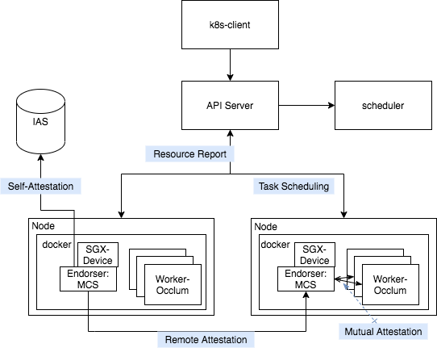
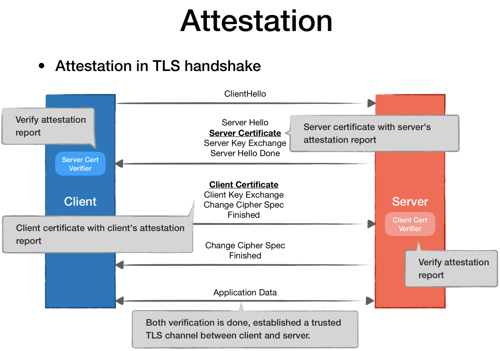

# TCOS设计

[toc]

​	提供内存安全的通用计算服务。支持SparkSQL和TensorFlow等通用计算框架。 应用于云上的安全可证计算场景，例如安全外包计算、联邦学习等场景。

​	本项目借助于LibOS实现Occlum最大程度的兼容原生App运行到SGX环境； 借助于K8S完成任务调度，并且结合多层信任传递机制，实现分布式计算任务之间的可信访问。

## 名词解释

* TCOS:  Trusted Cluster Operating System
* TA: Trusted Application
* RA: remote attestation
* K8S: kubernetes 
* mesatee-core-standalone（简称MCS）： 支持RUST快速编写TA的开发框架

## 安全模型

本方案保证：

* 本模型借助于TEE技术，保证计算过程安全；
* 借助于多重信任链传递机制，保证跨TA可信访问；

不解决： 

* 防止业务自身代码缺陷导致的安全漏洞（TCB过大问题）；

## 系统架构



<center> 图1：系统架构图</center>

Endorser:  基于mesatee-core-standalone（后面简称MCS）实现， 启动的时候完成TEE的完整性度量，之所以叫背书， 首先这个服务会完成自检，然后它负责去验证所有建立在当前机器上的TA的度量报告。

SGX-Devices: 通过K8S DaemonSet [4]在每个节点部署, 完成EPC资源的信息汇报， Worker的调度根据EPC资源进行调度；

Worker:   基于Occlum[5]运行用户的原生程序。所有的Worker需要加载fsgsbase模块；

​	业务实际部署的时候，基于Occlum构建自己的TA，然后通过K8S的客户端工具进行部署。

### Attestation 可信环境认证

​	在Intel SGX里面，认证过程耗时较长，取决于网络情况，虽然目前DCAP已经能够通PCCS服务进行证书缓存，一定程度上加速了认证的效率，但是相对在线服务的耗时来说，依然不可接受。

​	借助于MCS完成其所在的TEE的完整性度量。同时所有的TA都通过验证本地MCS的签发者的签名信息，完成对TEE的完整性校验。

​	那么在跨TA互访的时候，需要使用远程认证。但是我们依然可以利用MCS的特性，

​	文献[1],[2]提出了一种高效的认证手段，基本思路是将认证过程隐藏于TLS的验证过程中，首先服务端和客户端各自获取对应的度量报告（RA report）， 然后在服务端或者客户端对对方进行证书验证的时候，同时将度量报告放在证书后面，验证完成证书之后，立即验证度量报告。这种方式非常透明的隐藏了验证过程，保证建立链接的安全性，但是因为涉及到TLS过程的改动，对既有业务的迁移不够友好。

​	文献[3]提出了Self-attestation机制，这种机制通过在构建TA的时候，先生成公私钥对(SK, PK)，然后自发生成RA report，并将PK以及Report一起防止在X509格式的证书里面。然后实现一天类似于CA的机制对证书进行管理。那么实际远程验证的时候，先验证证书身份合法，然后验证RA report合法。 最后提出了一套基于DHT的分布式验证方案。这种方案依然需要依赖特殊的SDK在TA启动的时候进行认证，还是无法做到透明。

​	在K8S里面，跨App访问有Service和Ingress两种方式， Service有多种实现，包括userspace层面转发、iptables 以及IPVS等，都是在Layer 4做转发。 Ingress的实现基本原理是在Service的基础上，增加一层7层网关。然而在实际生产中使用的时候，复杂业务会利用Ingress做基于目录的转发，较为简单的业务直接基于Service就可以满足跨App访问的需求。考虑到网络栈L4无法理解应用层的TLS或者HTTP协议包的内容，因此无法在Service层直接进行验证。因此我们通过借助于一个Endorser机制，传递信任。

#### 信任链传递

首先介绍远程认证的基本思路，基本流程可以参考[2]之前的设计：



<center>图2：  TLS内置远程认证</center>

简单解释如下：

1. TA先Endorser发起Clienthello消息；
2. Endorser回复ServerHello, 同时携带X509证书；
3. TA验证Endorser的证书的合法性；验证SGX Report的合法性；TA将自己的签发者的证书和TA的证书信息回复给Endorser； 
4. Endorser验证证书的合法性，然后远程SGX Report合法； 
5. 最后基于前面协商的秘钥进行用户数据传输。

由图1可以看到，信任链建设过程如下：

1. Self-Attestation： Endorser在启动之前，通过获取自身的Report信息，然后连接IAS完成一次自证；

2. Mutual-Attestation： 完成本地TA与Endorser之间的相互认证,  TA启动的时候，通过Endorser暴露的NodeIp: Port完成一次双线验证，建立TLS连接，流程如图2.

3. 通过Remote-Attestation建立远端的Endorser之间的认证，从而建立不同的TA之间的相互认证。 理论上，只要1和2正确建立， 步骤3的远程认证不是必要的。 因为不同的Endorser已经被安全认证过了。


#### Mutual-Attestation验证时机

​	MA的验证应该发生在启动TA对外接受实际流量之前。

​	这里有2种方案，如果TA是基于Occlum编写，并且运行在原生的Docker容器上的话，我们需要对Occlum镜像增加一个pre script去完成跟Endorser的互认， Dockerfile如下:

```
ENTRYPOINT mutual-exec   ## 统一的TA入口
CMD TA-start-script   ## 用户启动命令
```

另外 mutual-exec的实现如下：

```shell
#!/bin/sh
1. mutual ra with Endorser
2. shift
3. exec $@ 
```

如果是基于inclavare-containers[6]进行编写，则需要考虑在container内部增加互相认证的插件，这个方案较为理想，但是需要比较细致的设计，后面专门介绍下。 

### 任务调度

​	自定义资源SGX EPC, 参考[4].


## 测试

1. 编译helloworld_c:

   ```
   $ cd {{occlum source code directory}}
   $ docker run  --net=host   -it --device /dev/sgx/enclave   -v $PWD:/occlum duanbing0613/helloc bash
   $ #省略步骤，按照文档5提供的样例步骤编译TA
   $ #修改start.sh的 workdir和`occlum run /bin/hello_world`命令
   $ #发布容器： docker commit & docker push
   $ docker commit -m "init tdos demo image"  tcos   ${image_name}
   $ docker push ${image_name}
   ```

2. 构建app.yaml, 以[app.yaml](./app.yaml)为模板， 修改其中的image、IAS_KEY和SPID等字段；

3. 按照文档7， 部署部署sgx-devices-plugin

4. 通过kubectl部署 [endorser](./endorser.yaml)

5. 通过kubectl部署Step 2构建的app.yaml

## 计划

​	目前这个只是一个Demo，说明当前思路可行。 接下来在以下几个方面进行持续迭代：

1. 将双向验证流程隐藏在Occulm启动之前完成; 
2. 资源管理优化， 针对大内存的EPC使用的优化；
3. 增加UI支持用户任务提交；

## 参考

1. Yu Ding, Ran Duan et.al  Rust SGX SDK: Towards Memory Safety in Intel SGX Enclave

2. https://github.com/apache/incubator-teaclave

3. Haofan Zheng et.al.  [Building secure distributed applications the DECENT way](https://arxiv.org/pdf/2004.02020.pdf)

4. https://github.com/AliyunContainerService/sgx-device-plugin

5. https://github.com/occlum/occlum

6. https://github.com/alibaba/inclavare-containers

7. [Ship MCS on K8S](https://github.com/xuperdata/mesatee-core-standalone/blob/master/docs/Ship mesatee-core-standalone on K8S.md)

   

