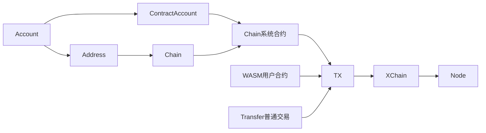
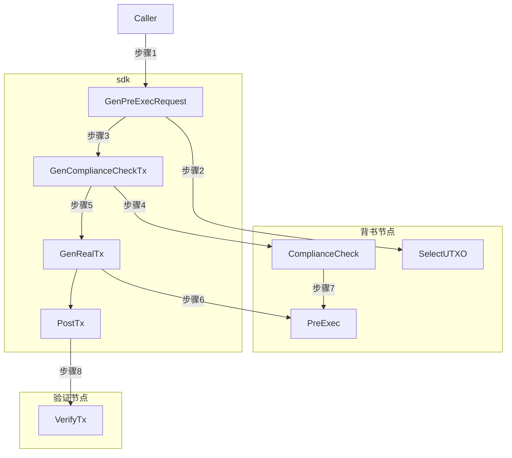

#  超级链SDK介绍

[TOC]

## 整体架构



## 账户

### 普通账户

属性：

```
// Account account structure
type Account struct {
	Address    string
	PrivateKey string
	PublicKey  string
	Mnemonic   string
}
```

行为：

* 创建账户: `func CreateAccount(strength uint8, language int) (*Account, error)` 

  根据密码强度和语言种类，创建一个新的账户。

  创建过程：直接调用crypto CreateNewAccountWithMnemonic创建账户。

  1. 根据密码强度产生对应位数的随机数(熵)
  2. 根据熵生成对应的助记词
  3. 根据助记词生成ECDSA私钥
  4. 生成账户

* 查询账户：`func RetrieveAccount(mnemonic string, language int) (*Account, error)`

  跟CreateAccount类似，只是不用生成助记词。

* 存储账户到文件：

   `func CreateAndSaveAccountToFile(path, passwd string, strength uint8, language int) (*Account, error)`

  将Account存储到path，用对称秘钥passwd加密

* 从文件恢复私钥： `func GetAccountFromFile(path, passwd string) (*Account, error) `

  CreateAndSaveAccountToFile的逆操作

### 合约账户

合约账户属于特殊的账户，包含多个普通账户，由多个账户共同控制，按照访问控制协议（ACL），通过多重签名等方式对合约发起操作。

* 创建合约用户： 创建合约是一个xkernel.NewAccount的系统合约，也就是说是基于密码学的，通过账本进行记录管理的**用户组**。

  - 通过地址创建： `func PreExecCreateAccountUseAddress(host, bcname, accountName, desc, address string) (*C.char, int32, int32) `

  * 通过私钥导出公钥，然后创建, 分2步：

    1. `func PreExecCreateAccount(host, bcname, accountName, desc, strJsonPrivateKey string) (*C.char, int32, int32) `

    2. `func TransferCreateAccountTxByPreExeResult(jsonPreExeResult, strJsonPrivateKey string) (*C.char, int32, int32) `

  * 通过私钥导出公钥，一次性提交创建合约的交易： `func CreateContractAccount(host, bcname, accountName, desc, binaryPrivateKey string) (*C.char, int32, int32) `

  host, bcname是访问某条链，步骤如下：

  1. InitContractAccount:  创建一个通信XChain对象，
  2. PreCreateContractAccount:  根据是否背书，调用PreExecWithSelecUTXO获得UTXO；
  3. PostCreateContractAccount:  根据第二部选的UTXO，调用GenCompleteTxAndPost发送请求到节点

* 

## 通信过程： XChain对象



```
// Xchain xchain struct
type Xchain struct {
	Cfg *config.CommConfig
	//	To     string
	//	Amount string
	ToAddressAndAmount map[string]string
	TotalToAmount      string
	Fee                string
	//	DescFile              string
	Desc                  string
	FrozenHeight          int64
	InvokeRPCReq          *pb.InvokeRPCRequest
	PreSelUTXOReq         *pb.PreExecWithSelectUTXORequest
	Initiator             string
	AuthRequire           []string
	Account               *account.Account
	PlatformAccount       *account.Account
	ChainName             string
	XchainSer             string
	ContractAccount       string
	IsNeedComplianceCheck bool
}
```

主要操作包括：

* PreExecWithSelecUTXO: 从超级链节点选出对应的UTXO

* GenCompleteTxAndPost:  产生完整的TX结构，然后签名，并且通过RPC发送到节点。 里面针对背书的逻辑比较混乱。

* PreExec： 去某个背书节点预执行当前交易， 包括普通交易以及合约。

* QueryTx: 查询交易

* PostTx: 发送完整的交易到节点

* ComplianceCheck:  判断当前交易是否符合监管规则，也就是我们在节点上内置了几个合约，以及中心化的服务去提供合法合规检测。实际上是个鸡肋，但是被滥用了的东西。

* GetBalanceDetail: 查询余额

* GenRealTxOnly:  组装普通交易，签名。 比GenRealTx 多了个HD加密。

* GenRealTx: 通上

* GenComplianceCheckTx: 产生特殊的监管判断交易

  

## Chain

目前包括创建平行链的接口。

## TX

TX作为交易结构体， 存储了一个交易最近的字段，交易结构体通过pb描述。	

"github.com/xuperchain/xuperchain/core/pb"

核心包括：

1. TXID： 交易ID，由于交易的内容的散列值
2. 交易/读写集
   1. From : Account： 来自于谁
   2. To: Account :  转移给谁
   3. Amount/RWSet ：UTXO : 转移的物体本质
3. Signature： From的签名


### Transfer

Transfer管理普通交易的发起，查询，以及加密Desc存储。	

### Wasm

用户合约，包括合约部署，执行以及合约查询接口。必须是合约账户才能发起。


